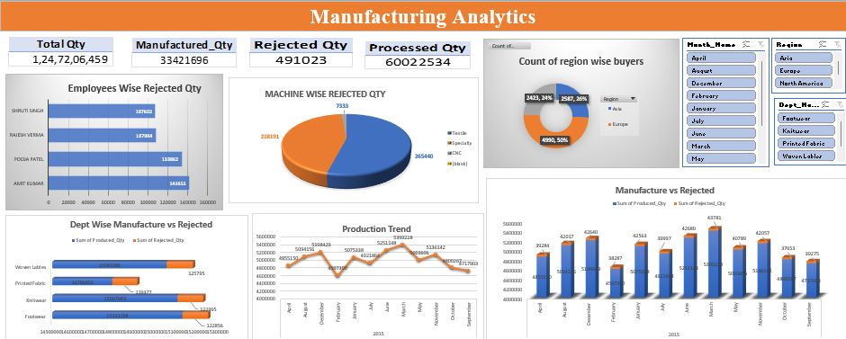

# Axon Manufacturing Analytics Dashboard

## Overview
Developed an interactive Manufacturing Analytics Dashboard using Power BI, SQL, Excel, Power Query, and DAX to monitor production, rejected quantity, processed quantity, machine performance, department performance, and monthly production trends.

## Tools Used
- Power BI
- SQL
- Excel
- Power Query
- DAX

## Dashboard Preview

!
